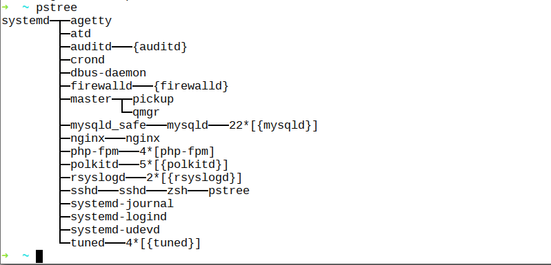

#Components of Linux Kernel
##unix process
###pstree
```zsh
pstree
```
- result


###process-creation
- fork, difference only lies in pid
  - adopt copy-on-write strategy, only do copy-operation until parent process and child process write to the memory page
- exec
  - load new program to current process memory to exec, replace the old programs' memory pages

###thread
- only requires mutex mechanism
- created with [clone](http://man7.org/linux/man-pages/man2/clone.2.html), enbale accurate check, to confirm which resources to share, which to make private
- > Unlike fork(2), clone() allows the child process to share parts of
       its execution context with the calling process, such as the memory
       space, the table of file descriptors, and the table of signal
       handlers.  (Note that on this manual page, "calling process" normally
       corresponds to "parent process".  But see the description of
       CLONE_PARENT below.)

###namespace
- make it possible to provide different views of system(which,e.g, contains pid)

###adress space
- since it is not relevant to physical available memory amount, it is also called virtual address space
  - every user process thinks it has own task_size memory, e.g, 3G user address space in whole 4G adress space
- task_size to 2^32/2^64 is reserved to kernel
- process priority: user-mode process is not allowed to access kernel space
